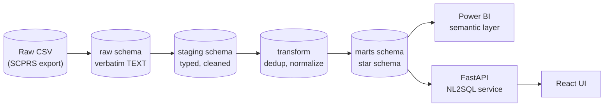

# Procurement Data Platform

An end-to-end analytics platform for public procurement data: a layered SQL
pipeline with data-quality validation, a Power BI semantic layer, an
LLM-powered natural-language-to-SQL interface with a rigorous correctness
benchmark, and a thin React/TypeScript UI.

**Dataset:** [California State Purchase Order Data](https://data.ca.gov/dataset/purchase-order-data)
(SCPRS extract, fiscal years 2012-2015, ~345k rows). See
[`scripts/download_data.md`](scripts/download_data.md) for how to obtain it —
raw data is never committed to this repository.

## Project status

| Stage | Deliverable | Status | Tag |
|---|---|---|---|
| 1 | SQL pipeline + data validation + pytest | 🚧 in progress | `v0.1.0` |
| 2 | Analytics export layer + Power BI support artifacts | ⏳ planned | `v0.2.0` |
| 3 | Text-to-SQL service + evaluation benchmark | ⏳ planned | `v0.3.0` |
| 4 | React/TS frontend | ⏳ planned | `v1.0.0` |

## Architecture



Postgres 16 holds four schemas (`raw` → `staging` → transform views → `marts`),
built entirely from hand-written, ordered `.sql` files executed by a thin
Python runner. See [AGENTS.md](AGENTS.md) for the full design and stage plan.

## Tech stack

- **Backend:** Python 3.11+, plain SQL (no ORM), `psycopg` v3
- **Database:** PostgreSQL 16 (Docker Compose)
- **API (Stage 3):** FastAPI, Pydantic v2, any OpenAI-compatible LLM endpoint (local Ollama by default)
- **Frontend (Stage 4):** Vite + React + TypeScript
- **Tooling:** `uv`, `ruff`, `pre-commit`, pytest, GitHub Actions

## Development setup

Prerequisites: [uv](https://docs.astral.sh/uv/), Docker + Docker Compose.

```bash
git clone https://github.com/kamilb222/procurement-data-platform.git
cd procurement-data-platform
cp .env.example .env

uv sync                     # install Python dependencies
uv run pre-commit install   # enable pre-commit hooks

docker compose up -d        # start Postgres 16
```

Then place the raw dataset at `data/raw/purchase_orders.csv` — see
[`scripts/download_data.md`](scripts/download_data.md).

## Repository layout

```
procurement-data-platform/
├── sql/              # 00_init -> 10_staging -> 20_transform -> 30_marts
├── src/pdp/          # importable package: config, db, pipeline, validation, export, nl2sql, api
├── scripts/          # CLI entry points (pipeline runner, profiling, exports)
├── tests/            # pytest, mirrors src/pdp
├── benchmark/        # Stage 3: NL2SQL evaluation harness
├── powerbi/          # Stage 2: model docs, measures, report spec
└── frontend/         # Stage 4: Vite + React app
```

## Stage 1 — SQL pipeline & data validation

🚧 In progress. This section will be filled in with run instructions, the
data-quality report summary, and screenshots once the stage is complete.

---

For the full project brief, stage gating rules, and definitions of done, see
[AGENTS.md](AGENTS.md).
